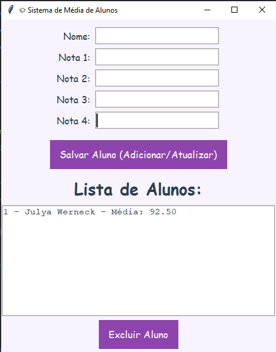
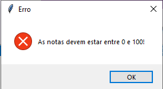
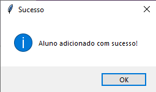
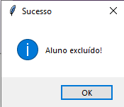

# 🎓 Sistema de Média de Alunos

Este é um sistema simples e funcional desenvolvido em **Python** utilizando **Tkinter** para a interface gráfica e **SQLite (via SQLAlchemy)** para persistência dos dados. O sistema permite o **cadastro**, **edição**, **exclusão** e **visualização** de alunos e suas médias com um visual moderno em tons de roxo, preto e branco.

---

## 🛠️ Tecnologias Utilizadas

- **Python 3.10+**
- **Tkinter** (GUI nativa do Python)
- **SQLAlchemy** (ORM para banco de dados)
- **SQLite** (banco de dados local)

---

## 📦 Funcionalidades

✅ Adicionar aluno com 4 notas  
✅ Cálculo automático da média  
✅ Edição de dados com preenchimento automático ao selecionar um aluno  
✅ Exclusão de alunos  
✅ Interface gráfica personalizada (visual fofo e clean)  
✅ Validação de notas (somente entre 0 e 100)  
✅ Banco de dados local com persistência usando SQLite

---

## 📷 Screenshots

### 🖥️ Interface Principal

### ⚠️ Erro: Nota deve ser entre 0 e 100

### ✏️ Aluno Alterado

### ➕ Aluno Adicionado

### ❌ Aluno Excluído

---

## 👩‍💻 Autor

Desenvolvido por **Julya Werneck**, estudante de Ciência da Computação.
📚 Projeto acadêmico para a disciplina de **Desenvolvimento Rápido de Aplicações em Python**.

---
